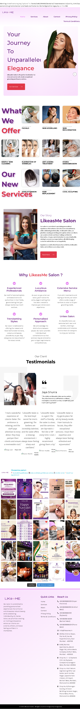
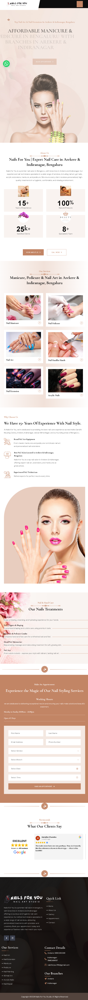

# 🌐 Client Web Projects

A showcase of websites I've designed and developed for various clients as part of my role at a digital marketing agency (2+ years experience).

## 💼 About My Work
As a Website Developer, Designer & Editor, I've worked on end-to-end website design and development for clients across multiple industries — beauty, real estate, and renewable energy.

---

## 1️⃣ Like A Salon - Beauty Salon
🔗 **Live Site:** [likeasmesalon.in](https://likeasmesalon.in/)

A modern, elegant website for a beauty salon featuring services, testimonials, and easy contact/booking options.

---

## 2️⃣ Eleanor Skin and Nails - Beauty Centre & Nail Studio Academy
🔗 **Live Site:** [eleanorskinandnails.in](https://eleanorskinandnails.in/)

Website for a beauty and nail care academy, showcasing courses, treatments, and studio services.

---

## 3️⃣ Nails For You Studio - Nail Studio Academy
🔗 **Live Site:** [nailsforyoustudio.com](https://nailsforyoustudio.com/)

A dedicated website for a nail art and studio academy, highlighting training programs and services.

---

## 4️⃣ Plots Dholera - Real Estate
🔗 **Live Site:** [plotsdholera.com](https://plotsdholera.com/)

A real estate website for plot listings in Dholera, designed to showcase property details and generate leads.

---

## 5️⃣ GM Solar Corporation - Solar Panel Company
🔗 **Live Site:** [gmsolarcorporation.com](https://gmsolarcorporation.com/)

Corporate website for a solar panel company, presenting products, services, and company information.

---

## 🛠️ My Role
- Website Design
- Website Development
- Graphics & Visual Content
- Ongoing Website Maintenance

## 👨‍💻 Author
**Anup Pathak**
Website Developer | Designer | Video Editor
